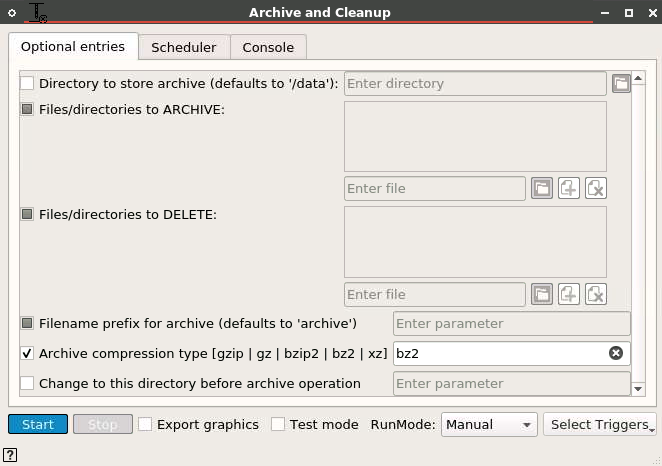
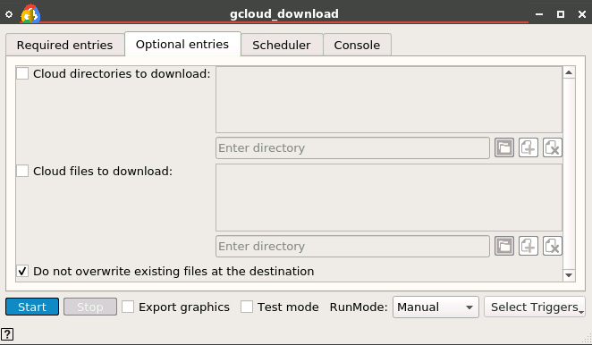
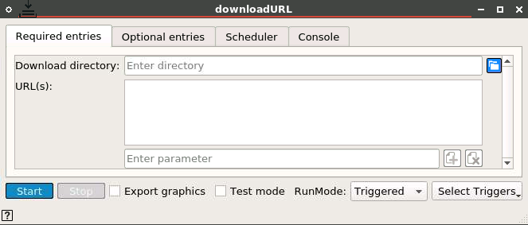
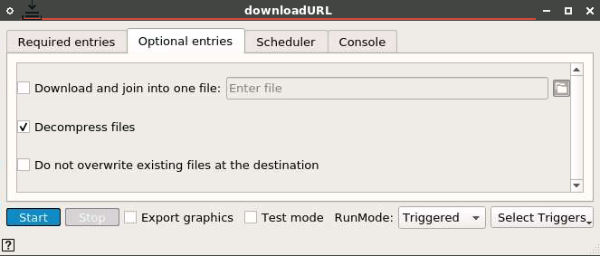
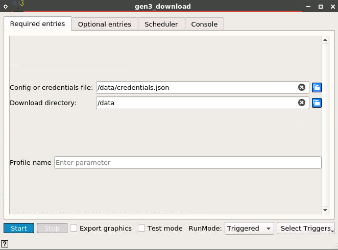

# GATK Germline Workflow

## Implemented with the BioDepot-workflow-builder (Bwb)

# Table of Contents
* [Overview](#overview)
  * [Reference genome](#reference-genome)
  * [Workflow in the demo state](#workflow-in-the-demo-state)
  * [Modifying workflow for alternate samples](#modifying-workflow-for-alternate-samples)
  * [Modifying workflow for alternate reference genome](#modifying-workflow-for-alternate-reference-genome)
  * [Archive and cleanup output files](#archive-and-cleanup-output-files)
* [Appendix](#appendix)
  * [Download widgets](#download-widgets)
    * [gcloud_download](#gclouddownload)
    * [downloadURL](#downloadurl)
    * [gen3_download](#gen3download)
  * [Common issues with workflows](#common-issues-with-workflows)
  * [Software and hardware specifications](#software-and-hardware-specifications)
* [References](#references)

# Overview

## Reference genome
All alignments are performed using the human reference genome Homo_sapiens_assembly38.fasta. This can be found here: [https://console.cloud.google.com/storage/browser/gcp-public-data--broad-references/hg38/v0](https://console.cloud.google.com/storage/browser/gcp-public-data--broad-references/hg38/v0)

## Workflow in the demo state
Begin the workflow by clicking the Start button from the Start widget.

## Modifying workflow for alternate samples
The bam or fastq samples should be downloaded to the Bwb mapped /data/work directory. To change the default location or name of the sample files, the Start widgets required input filenames should be updated to reflect this change.

The sample files are downloaded via the gcloud_download widget in the demo state. Swap out the widget named ‘Download sample’ with the preferred download widget (see appendix section _download widgets_ for detailed instructions on usage).

Connect the Start widgets work directory output to the input download directory of the widget, also connect any output of the download widget to the input trigger of the biobambam2 widget. Configure Run mode of the supplied download widget for ‘Triggered’, and select ‘downloadDir’ from the dropdown as pictured below.

## Modifying workflow for alternate reference genome
The default reference genome is downloaded via the widget named ‘Download GATK files’. If the reference file(s) are updated, populate the changes via the Start widget genome file field.

## Archive and cleanup output files
All outputs of the DNA-seq workflow can be archived into a tar file and then deleted from the workspace. This is an optional step in the workflow that requires the Archive and Cleanup widget be opened and then selected using the Start button.  By default the widget will archive using bzip2 compression and include the sample input files as well as any optional pedigree file supplied via the Start widget.

# Appendix
## Download widgets
There are a number of widgets for downloading files within Bwb:

### gcloud_download

Google Cloud is accessible via the _gcloud_download_ widget.

### downloadURL
Google Drive and any URL not requiring credentials is accessible via the _downloadURL_ widget.

### gen3_download
GEN3 data commons and the GDC data portal are accessible via the _gen3_download_ widget.

## Common issues with workflows
One of the biggest issues with workflows is that several tools will change throughout the course of their life cycles. Often major revisions of tools will come with option changes. Certain options may be deprecated or deleted entirely. Sometimes option flags will be renamed or inputs will need to be passed in a different way. All of these things sound very minor but turn what could be a straightforward workflow into a several hour debugging session. The point is to use care when updating tool versions or widgets.

## Software and hardware specifications
The GATK Germline workflow was tested on an AWS Elastic Cloud Compute (EC2)  instance with the following specifications:

| Option | Value |
| - | - |
| Instance Type | r5d.2xlarge
| Distribution | Ubuntu server 20.04
| Disk space | 50GB
| Memory | 64GB
| vCPU | 8

The workflow was tested with version 1.0 of Bwb ([https://github.com/BioDepot/BioDepot-workflow-builder/releases/tag/v1.0,0](https://github.com/BioDepot/BioDepot-workflow-builder/releases/tag/v1.0,0))

# References
