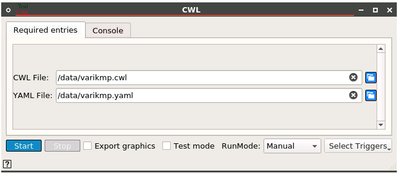
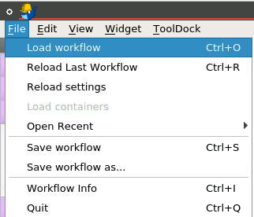
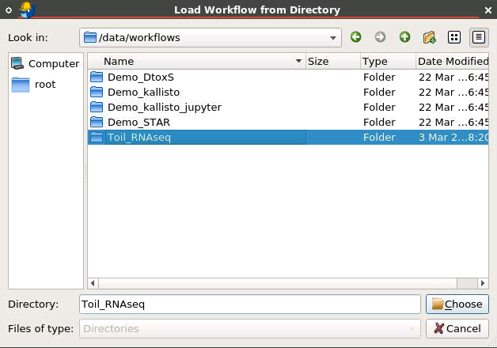
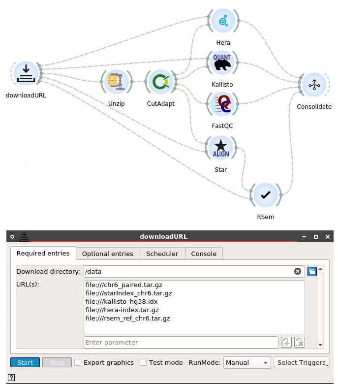

# BioDepot BWB Toil Plugin

Main Tool: https://github.com/BioDepot/BioDepot-workflow-builder

# Deployment:

We do not install Toil in Bwb containers to minimize the size of the container's image of Bwb. To use Toil without installation, we wrote a Docker file to build an image that consists of Toil, including the docker command-line tool (Docker CLI). Why do we need to have the Docker CLI? To leverage bioinformatics software without installation, we intend to use the Toil to call Docker containers using Docker images of those tools. We also need to map the volume of the "docker.sock" directory from the host machine. It is the UNIX socket that the Docker daemon is listening to and the main entry point for Docker API.

# How to use Toil widgets:

1\. There are three types of Toil widgets: Common Workflow Language (CWL), Workflow Description Language (WDL), and Basic Python-scripted Workflow. Here is the example of using Toil CWL widget. Click on the Toil CWL icon to create a Toil CWL/WDL/Python widget.

  

Edit the widget and select the tab "**Volume**". Make sure that option "**Pass mappings for launching containers**" checked. This step is to ensure that the Toil container will have the volume mapping to the **/var/run/docker.sock** directory from the host machine (we rely on the docker daemon on the host machine).

We now double-click on that widget to select **CWL file** along with the data file (**YAML file**)

When the console says "**Finished**" and returns the **exit code** and **exit status** both **zeroes**, that means you successfully executed the Toil CWL file without technical errors at different container levels. (nested containers)

# How to use Toil RNA_seq Workflow:

The structure of the RNA_seq workflow followed this source: https://github.com/BD2KGenomics/toil-rnaseq

1\. Load the workflow.

2\. Select the Toil RNA_seq workflow.

3\. Adjust the data input URLs.

The current files in the list are on local machine.

We can also change them to direct URLs to test the RNA_seq workflow as follow:

http://courtyard.gi.ucsc.edu/~jvivian/toil-rnaseq-inputs/continuous_integration/chr6_paired.tar.gz
http://courtyard.gi.ucsc.edu/~jvivian/toil-rnaseq-inputs/continuous_integration/starIndex_chr6.tar.gz
http://courtyard.gi.ucsc.edu/~jvivian/toil-rnaseq-inputs/kallisto_hg38.idx
http://courtyard.gi.ucsc.edu/~jvivian/toil-rnaseq-inputs/hera-index.tar.gz
http://courtyard.gi.ucsc.edu/~jvivian/toil-rnaseq-inputs/rsem_ref_hg38_no_alt.tar.gz

# Tutorial Video:

